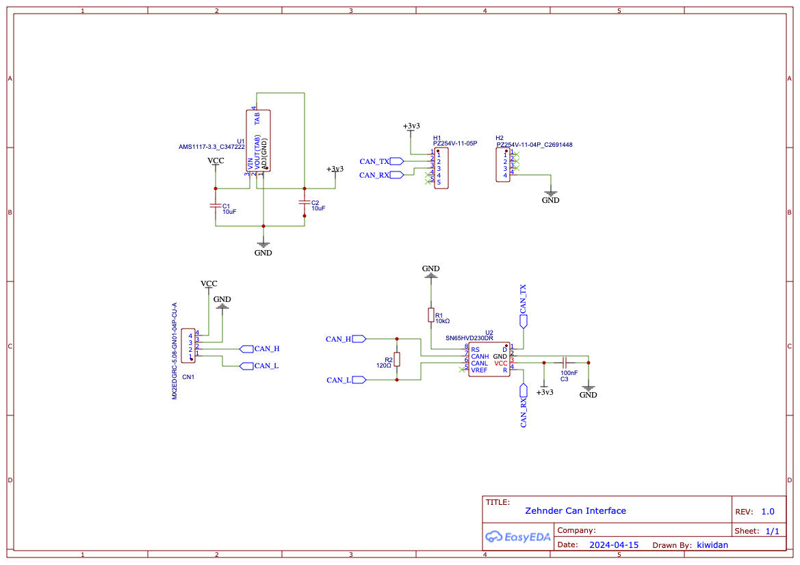

# Custom PCB v2

This option uses a custom pcb to connect the ATOM Lite to the can bus. 

 ![Custom PCB][bare]
 ![Custom PCB with ATOM][atom]

Schematic is identical to the already tested design from [vekexasia](https://github.com/vekexasia/comfoair-esp32/issues/49#issuecomment-1578201546)

  


All required documents to order boards or customize the current design are available in the [pcb folder](docs/pcb/) 

  - [Schematics PDF](docs/pcb/Schematic_ZehnderCan-V2_2024-05-12.pdf)
  - [Schematics JSON](docs/pcb/SCH_ZehnderCan-V2_2024-05-12.json) that can be imported in [EasyEDA](https://easyeda.com/)

Files required to order custom boards from [JLCPCB](https://jlcpcb.com/)

  - [Gerber files](docs/pcb/Gerber_ZehnderCan-V2_PCB_ZehnderCan-V2_2024-05-12.zip)
  - [Bill of Material](docs/pcb/BOM_ZehnderCan-V2_2024-05-12.csv)
  - [Pick and Place](docs/pcb/PickAndPlace_PCB_ZehnderCan-V2_2024-05-12.csv)


## Connection Diagram

Using ComfoNet RJ45 connector

```

|----------------+ 
|                | 
|   [ComfoAir]   | 
|                |                                           custom pcb
|                |      +++++++++++++++++++++            +-----------------+
|           RJ45 o------| (w/orange)  CAN-L o------------o CAN-L           |
|----------------+      | (  orange)  CAN-H o------------o CAN-H           |
                        |  (w/green)    GND o------------o GND             |
                        |     (blue)   +12V o------------o +12V            |
                        +++++++++++++++++++++            +-----------------+

```

Using ComfoNet plug-in connections
```

|------------------+                custom pcb
|    [ComfoAir]    |            +-----------------+
|   (white)  CAN-L o------------o CAN-L           |
|  (yellow)  CAN-H o------------o CAN-H           |
|   (black)    GND o------------o GND             |
|     (red)   +12V o------------o +12V            |
|------------------+            +-----------------+

```

## Installed 

I currently have two boards connected, one that uses the code from this repo and the other to do can sniffing enabling verbose logging

![Installed using ComfoNet plug-in connection][installed_1]
![Installed using ComfoNet RJ45 connection][installed_2]

## Notes

As you can see the board size could be slightly reduced and I now think it would be more useful to use a [Spring Clamp Terminal Block](https://www.lcsc.com/product-detail/Spring%20Clamp%20System%20Terminal%20Block_Phoenix-Contact-1861959_C6656102.html) like this one.

![terminal_block]

New board design in the pipeline, just for the fun of making these...

[bare]: ./docs/custom_pcb_bare.png
[atom]: ./docs/custom_pcb_incl_atom.png
[installed_1]: ./docs/custom_pcb_installed_1.png
[installed_2]: ./docs/custom_pcb_installed_2.png
[terminal_block]: ./docs/Phoenix-Contact-1861959.png

